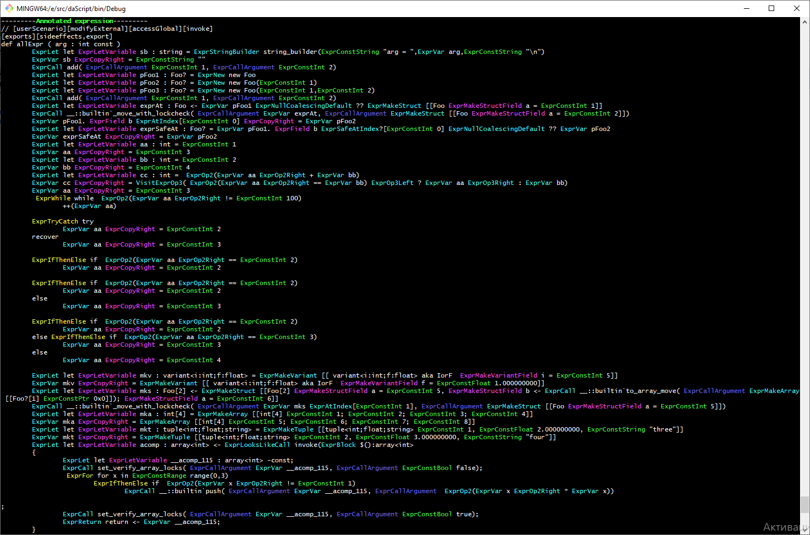

Macro for print functions ast

https://spiiin.github.io/blog/4109146319/ - post with idea

```
options optimize = false
require expr_print

struct SaySomethingParams
    a, b : int

def function1()
    var params <- new [[SaySomethingParams() a = 1, b = 2]]
    return params

[export]
def main()
    print_expression(@@function1)

//Output:
---------Annotated expression---------
// [nosideeffects]
def function1 : SaySomethingParams?
        ExprLet let ExprLetVariable params : SaySomethingParams? <- ExprAscend new ExprMakeStruct [[SaySomethingParams ExprMakeStructField a = ExprConstInt 1, ExprMakeStructField b = ExprConstInt 2]]
        ExprReturn return ExprVar params
--------------------------------------
```


